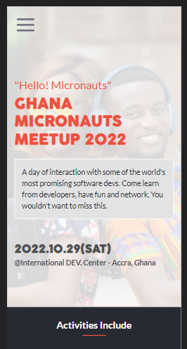

# Micronauts Meetup 2022

## First-Microverse-Capstone-Project

## Built With

- HTML
- CSS
- JavaScript

## Live Demo

[Live Demo Link](https://benjaminsemah.github.io/AlumniMeetup/)

## Presentation

[Presentation video](https://www.loom.com/share/229a2670fa3546c29ddcc107ce895b6f)

## Author

👤 **Benjamin Semah**

- GitHub: [Benjamin Semah](https://github.com/BenjaminSemah)
- LinkedIn: [Benjamin Semah](https://www.linkedin.com/in/benjaminsemah/)
- Twitter: [Benjamin Semah](https://twitter.com/BenjaminSemah)

## 🤝 Contributing

Contributions, issues, and feature requests are welcome!

Feel free to check the [issues page](https://github.com/BenjaminSemah/AlumniMeetup/issues).

## Acknowledgments

### UI/UX Designer

- [Cindy Shin](https://www.behance.net/adagio07)

### Photo Credits

- [Kindel Media from Pexels](https://www.pexels.com/photo/man-people-woman-car-6869044/)

- [Tony Schnagl from Pexels](https://www.pexels.com/photo/man-in-brown-suit-holding-clear-drinking-glass-5588488/)

- [Prostooleh from FreePik](https://www.freepik.com/photos/people)

- [Drobotdean from FreePik](https://www.freepik.com/photos/business)

- [Pressfoto from FreePik](https://www.freepik.com/photos/technology)

## Show your support

Give a ⭐️ if you like this project!

## 📝 License

This project is [MIT](./MIT.md) licensed.
